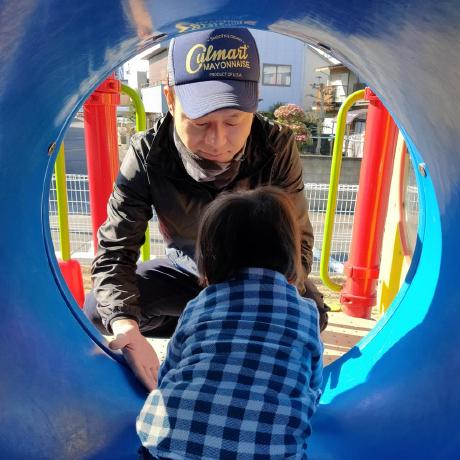
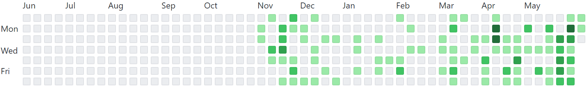
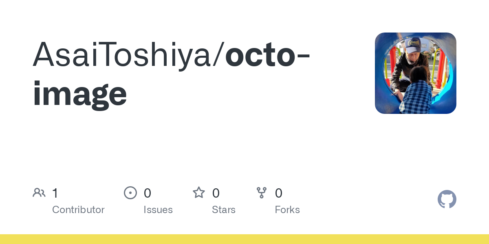

[日本語](./README.md) | English

# octo-image

octo-image is a command line tool to get various images on GitHub.

Google Chrome is required to work.

## Install

```bash
npm i -g octo-image
```

## Usage

### Avatar

```bash
octo-image avatar <user>
```



### Contribution Graph

```bash
octo-image contribution-graph <user>
```



### Involves

```bash
octo-image involves [--absolute-time] [--exclude-user <user>] [--sort <criteria>] <user>
```

[involves.png](./examples/involves.png)

### Open Graph

```bash
octo-image open-graph <user> <repo>
```



## API

<!-- Generated by documentation.js. Update this documentation by updating the source code. -->

### avatar

<pre><code class="javascript">import { avatar } from "octo-image";
</code></pre>

#### Parameters

*   `user` **[string](https://developer.mozilla.org/docs/Web/JavaScript/Reference/Global_Objects/String)** ユーザー

### contributionGraph

<pre><code class="javascript">import { contributionGraph } from "octo-image";
</code></pre>

#### Parameters

*   `user` **[string](https://developer.mozilla.org/docs/Web/JavaScript/Reference/Global_Objects/String)** ユーザー
*   `year` **[number](https://developer.mozilla.org/docs/Web/JavaScript/Reference/Global_Objects/Number)?** 年

### involves

<pre><code class="javascript">import { involves } from "octo-image";
</code></pre>

#### Parameters

*   `user` **[string](https://developer.mozilla.org/docs/Web/JavaScript/Reference/Global_Objects/String)** ユーザー
*   `absoluteTime` **[boolean](https://developer.mozilla.org/docs/Web/JavaScript/Reference/Global_Objects/Boolean)?** true の場合は絶対時刻。それ以外の場合は相対時刻
*   `excludeUser` **[string](https://developer.mozilla.org/docs/Web/JavaScript/Reference/Global_Objects/String)?** 除外するユーザー
*   `sort` **[string](https://developer.mozilla.org/docs/Web/JavaScript/Reference/Global_Objects/String)?** ソート修飾子。<https://docs.github.com/ja/search-github/getting-started-with-searching-on-github/sorting-search-results> を参照

### openGraph

<pre><code class="javascript">import { openGraph } from "octo-image";
</code></pre>

#### Parameters

*   `user` **[string](https://developer.mozilla.org/docs/Web/JavaScript/Reference/Global_Objects/String)** ユーザー
*   `repo` **[string](https://developer.mozilla.org/docs/Web/JavaScript/Reference/Global_Objects/String)** リポジトリ

## Development

### Repository

```bash
git clone https://github.com/AsaiToshiya/octo-image.git
cd octo-image
npm install
```

### Publishing

```bash
npm version minor
git push origin main
git push origin --tags
```

## License

    MIT License

    Copyright (c) 2022 Asai Toshiya

    Permission is hereby granted, free of charge, to any person obtaining a copy
    of this software and associated documentation files (the "Software"), to deal
    in the Software without restriction, including without limitation the rights
    to use, copy, modify, merge, publish, distribute, sublicense, and/or sell
    copies of the Software, and to permit persons to whom the Software is
    furnished to do so, subject to the following conditions:

    The above copyright notice and this permission notice shall be included in all
    copies or substantial portions of the Software.

    THE SOFTWARE IS PROVIDED "AS IS", WITHOUT WARRANTY OF ANY KIND, EXPRESS OR
    IMPLIED, INCLUDING BUT NOT LIMITED TO THE WARRANTIES OF MERCHANTABILITY,
    FITNESS FOR A PARTICULAR PURPOSE AND NONINFRINGEMENT. IN NO EVENT SHALL THE
    AUTHORS OR COPYRIGHT HOLDERS BE LIABLE FOR ANY CLAIM, DAMAGES OR OTHER
    LIABILITY, WHETHER IN AN ACTION OF CONTRACT, TORT OR OTHERWISE, ARISING FROM,
    OUT OF OR IN CONNECTION WITH THE SOFTWARE OR THE USE OR OTHER DEALINGS IN THE
    SOFTWARE.
